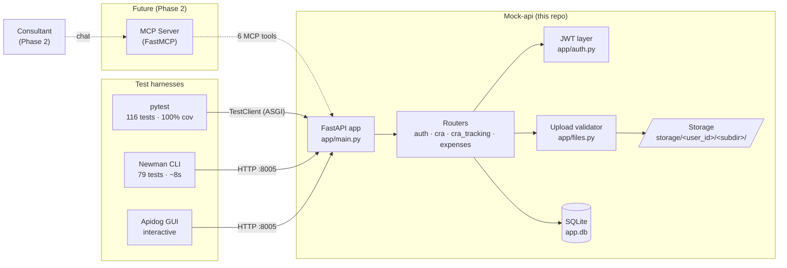
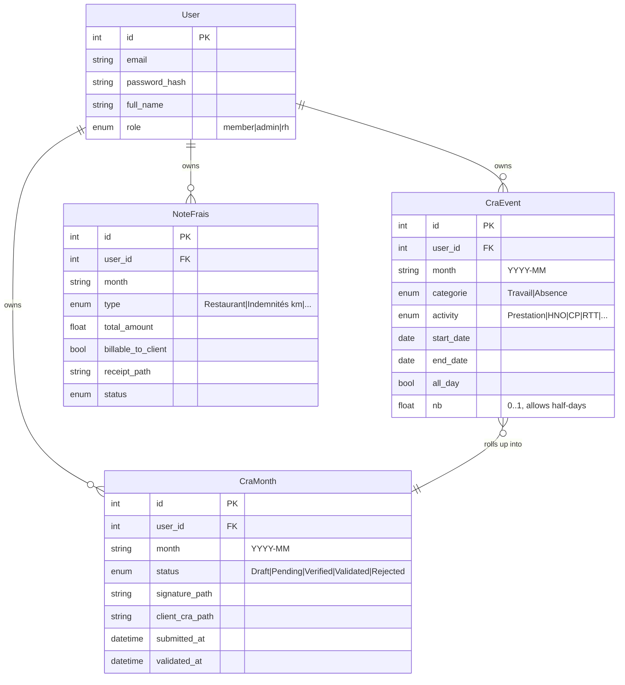
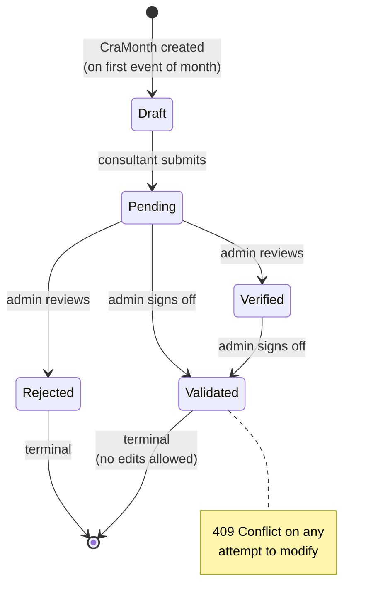
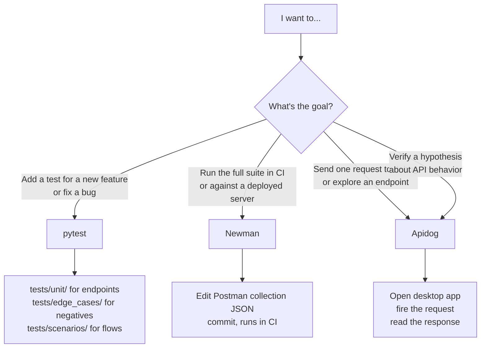
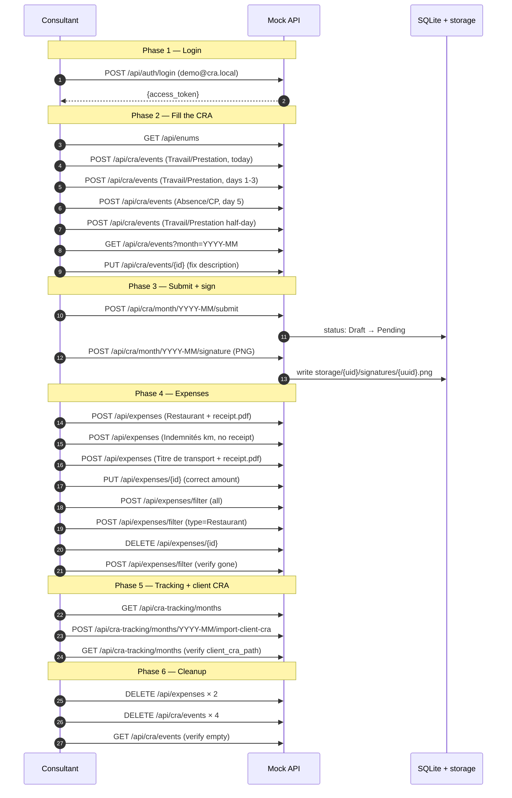

# STAGE-ISM — Project Map

> Single-page map of the **CRA-Expenses-AI-Connector** mock API and its
> three testing strategies. New contributors should be productive within
> 10 minutes of reading this.

## 1. Project overview

This repo is the foundation of an **8-week internship** building an MCP
(Model Context Protocol) server that automates monthly expense + timesheet
filing on the Cooptalite/Portalite consultant portal. The MCP server itself
is Phase 2 of the internship; **Phase 1 (this repo) ships a FastAPI mock
backend** that the MCP server will be developed against.

The mock simulates three pages of the real portal:

| Portal page | API surface | What it does |
|---|---|---|
| **CRA** (activity calendar) | `/api/cra/*` | Consultant logs work days and absences as events; each month rolls up into a `CraMonth` they submit for validation. |
| **My Expenses** | `/api/expenses/*` | Declare expenses (`NoteFrais`) with optional receipts. |
| **My CRA Tracking** | `/api/cra-tracking/*` | History of past months + upload of signed client CRA PDFs. |

## 2. Stack

| Layer | Choice |
|---|---|
| Language | Python 3.12+ |
| Framework | FastAPI + SQLModel |
| Storage | SQLite (`mock-api/app.db`) + filesystem (`mock-api/storage/`) for uploads |
| Auth | OAuth2 password flow → JWT (HS256), via `python-jose` + `passlib[bcrypt]` |
| Package manager | `uv` |
| Testing | pytest (canonical), Newman (CLI scenarios), Apidog (interactive) |
| Lint | Ruff |

## 3. Architecture



## 4. Quickstart

```powershell
# clone and install
cd mock-api
uv sync --dev

# run the server (port 8005 is canonical across this repo)
uv run uvicorn app.main:app --reload --port 8005

# Or on Windows: double-click apidog/scripts/start_server.bat
```

| What | URL |
|---|---|
| Swagger UI | http://localhost:8005/docs |
| OpenAPI JSON | http://localhost:8005/openapi.json |
| Health | http://localhost:8005/healthz |

Demo user (auto-seeded on first start): `demo@cra.local` / `demo1234`.

**Reset state** between scenario runs: stop the server, `del mock-api\app.db`, restart.

## 5. Domain model

### 5.1 Entities



### 5.2 Status workflow (CraMonth and NoteFrais share this enum)



`NoteFrais` skips `Draft` — it's created directly in `Pending`.

### 5.3 Category × activity rules

| Category | Allowed activities |
|---|---|
| `Travail` | `Prestation`, `HNO`, `Astreinte` |
| `Absence` | `CP`, `RTT`, `Maladie`, `Sans solde`, `Autre` |

Mismatched pairs (e.g. `Travail` + `CP`) return `400`. Enforced both on
create and on partial update.

### 5.4 Receipt requirement

Required for every expense type **except** `Indemnités kilométriques`
(mileage allowance is computed from a per-km rate, no proof needed).

## 6. API surface (summary)

Full reference — every endpoint, payload, status code, gotcha — lives in
[`mock-api/docs/API.md`](mock-api/docs/API.md). Quick map:

| Group | Endpoints |
|---|---|
| Auth | `POST /api/auth/login` · `GET /api/auth/me` |
| CRA events | `GET / POST /api/cra/events` · `PUT / DELETE /api/cra/events/{id}` |
| CRA month | `POST /api/cra/month/{m}/submit` · `POST /api/cra/month/{m}/signature` |
| Tracking | `GET /api/cra-tracking/months` · `POST /api/cra-tracking/months/{m}/import-client-cra` |
| Expenses | `POST /api/expenses/filter` · `POST /api/expenses` · `PUT / DELETE /api/expenses/{id}` |
| Meta | `GET /healthz` · `GET /api/enums` |

**Conventions:** months are strings (`YYYY-MM`). Login uses OAuth2 form
encoding (`username` field carries the email). All other endpoints take JSON
or `multipart/form-data` for uploads. JWT in `Authorization: Bearer <token>`.

## 7. Testing strategies

Three independent ways to exercise the same API. **They complement each
other** — use the right one for the right job.

### 7.1 pytest — canonical (development inner loop)

**Location:** [`mock-api/tests/`](mock-api/tests/)

**Numbers:** 116 tests · 100% line coverage · ~50s full run

```powershell
cd mock-api
uv run pytest                            # all
uv run pytest tests/unit/                # per-router
uv run pytest tests/scenarios/           # real-world flow
uv run pytest --cov=app --cov-report=term
```

**Key design choices:**
- Uses `fastapi.testclient.TestClient` — runs the app in-process, no HTTP
  port needed. ~10× faster than hitting a real Uvicorn.
- Per-test isolated tmp SQLite DB + storage dir (via `tmp_path` + monkeypatch).
- Helper verbs in `tests/_helpers.py` (`create_event`, `submit_month`, …)
  make scenario tests read like prose.
- Parametrized negatives collapse what would be ~30 separate Newman requests
  into single test functions with `@pytest.mark.parametrize`.

**Tree:**
```
mock-api/tests/
├── conftest.py            ← client + auth_headers + date fixtures
├── _helpers.py            ← reusable verbs
├── unit/                  ← per-router (test_auth, test_cra, …)
├── edge_cases/            ← parametrized negatives + 409 conflicts + JWT
└── scenarios/             ← test_real_world.py (the 28-step flow)
```

### 7.2 Newman CLI — black-box regression

**Location:** [`apidog/cra_mock_api.postman_collection.json`](apidog/cra_mock_api.postman_collection.json)

**Numbers:** 79 tests · ~8s full run

```powershell
newman run apidog\cra_mock_api.postman_collection.json `
  -e apidog\environment.postman.json
```

**Three folders:**
| Folder | Tests |
|---|---|
| `01 — Happy Path E2E` | 14 |
| `02 — Real World Flow` | 28 |
| `03 — Edge Cases` | 37 (auth errors, all activity/expense types, pagination) |

**What it's good for:** running the same tests Apidog runs, but headlessly
in CI or against a deployed server. Hits the real HTTP stack so it catches
issues TestClient can't (CORS, middleware order, real serialization).

### 7.3 Apidog GUI — interactive / exploratory

**Location:** [`apidog/`](apidog/) + the Apidog desktop app

**Numbers:** 0 tests in source — scenarios live in
[`apidog/scenarios/*.md`](apidog/scenarios/) as walkthroughs you build by hand
in the GUI

**What it's good for:**
- Sending a single ad-hoc request while debugging
- Visualizing the response body / headers / timings
- Tweaking parameters live and replaying
- Onboarding (Swagger-UI replacement with state + variable chains)

**What it's bad for:** authoring a 28-step scenario from scratch. Manual
clicking is slow (~3-5 min/step × 28 = ~2h) and the work doesn't end up in
git in a portable format.

### 7.4 Comparison table

| | pytest | Newman | Apidog |
|---|---|---|---|
| Primary use | Dev inner loop, regression | CI, black-box regression | Exploration, debugging |
| Run location | CLI / IDE | CLI | Desktop GUI |
| Full-suite speed | ~50s (116 tests) | ~8s (79 tests) | Interactive |
| HTTP layer | In-process (ASGI) | Real `localhost:8005` | Real `localhost:8005` |
| Test count | **116** | 79 | 0 (manual) |
| Line coverage | **100%** | API surface only | API surface only |
| Assertions | Native Python `assert` | JS `pm.expect(...)` | Visual builder + JS |
| Variable chaining | Python locals | `pm.environment.set` | UI post-processors |
| Data setup | Fixtures + tmp DB | Pre-request scripts | Manual env vars |
| Debug | Breakpoints, pdb | `console.log` | Click-through |
| CI/CD friendly | ✓ | ✓ | ✗ |
| Source-controlled | ✓ (Python) | ✓ (JSON) | ✗ (lives in app) |
| Best at | Edge cases, mocks, branches | Black-box smoke + regression | One-off requests |

### 7.5 Decision guide — which one should I use?



**Rule of thumb:**
- Writing or fixing code → **pytest** (fastest feedback, best debugging)
- Pre-merge / CI gate → **Newman** (deterministic, black-box)
- "Does this endpoint do what I think?" → **Apidog**

## 8. Real-world scenario testing

This is the part that motivates having three tools instead of one. Single
endpoint tests are easy. The hard part is testing what a consultant
actually does each month: a chain of ~28 dependent operations.

> 📖 **For a hands-on, tool-agnostic walkthrough** of every step with
> concrete `curl` requests, sample responses, and DB / filesystem
> verification, see [`mock-api/docs/WALKTHROUGH.md`](mock-api/docs/WALKTHROUGH.md).
> This section explains the **strategy** — the WALKTHROUGH is the runbook.

### 8.1 What "real world" means here

A consultant's monthly cycle isn't a CRUD smoke test — it's an ordered
workflow where each step depends on previous state:

1. Log in (need JWT for everything else)
2. Fill the CRA: mix of single days, multi-day ranges, absences, half-days
3. Submit the month (Draft → Pending)
4. Sign it (upload signature image)
5. Declare expenses across multiple types (some with receipts, some without)
6. Update a mistake
7. Check the tracking page
8. Import the signed client CRA PDF
9. Clean up

Variables flow between steps: `bearerToken` from login, `event_id_1..4`
from each create-event step, `expense_id_1..3` from each create-expense
step. Testing that this chain works as a **whole** is different from
testing each step in isolation.

### 8.2 The 28-step flow



Each tool runs the **same** flow. The difference is how it's authored,
how variables propagate, and how it's run.

### 8.3 Same flow, three implementations

#### As pytest — [`tests/scenarios/test_real_world.py`](mock-api/tests/scenarios/test_real_world.py)

~120 lines, one test function. Helpers (`create_event`, `submit_month`, …)
hide the HTTP boilerplate; the test body reads like the markdown spec.

```python
def test_real_world_consultant_monthly_flow(client, auth_headers, today, ...):
    # Phase 2 — fill the CRA
    e1 = create_event(client, auth_headers, start_date=today)
    e2 = create_event(client, auth_headers, start_date=month_start, end_date=month_day_3)
    e3 = create_event(client, auth_headers, categorie="Absence", activity="CP", ...)
    e4 = create_event(client, auth_headers, all_day=False, nb=0.5, ...)

    events = list_events(client, auth_headers, current_month)
    assert {e1["id"], e2["id"], e3["id"], e4["id"]}.issubset({ev["id"] for ev in events})

    # Phase 3 — submit + sign
    month = submit_month(client, auth_headers, current_month)
    assert month["status"] == "Pending"
    upload_signature(client, auth_headers, current_month, sample_png)

    # ... etc
```

Strengths: shortest, easiest to debug (breakpoints), runs in <2s, isolated
DB per run.

#### As Postman/Newman — [`apidog/cra_mock_api.postman_collection.json`](apidog/cra_mock_api.postman_collection.json)

~500 lines of JSON in the `02 — Real World Flow` folder. Each request has
a pre-script + test-script. Variables propagate via `pm.environment.set`
and `pm.environment.get`. Runs in 8 seconds.

```javascript
// Step 03 — Create single work day (test script)
pm.test('status 201', () => pm.response.to.have.status(201));
const j = pm.response.json();
pm.expect(j.nb).to.equal(1.0);
pm.environment.set('event_id_1', j.id);
```

Strengths: language-agnostic, runs anywhere Newman runs (CI, GitHub Actions),
no Python required.

#### As Apidog — [`apidog/scenarios/real_world_flow.md`](apidog/scenarios/real_world_flow.md)

A markdown walkthrough you build by hand in the GUI. Each step becomes a
manually-configured request with a pre-script/post-processor and assertions.

Strengths: visual, click-through debugging.
Weakness: ~1.5h to build all 28 steps; not portable to git or CI.

### 8.4 Trade-offs side-by-side

| | pytest scenario | Newman scenario | Apidog scenario |
|---|---|---|---|
| Source LOC | ~120 lines Python | ~500 lines JSON | ~28 manually-built steps |
| Author time | ~30 min | ~30 min (write JSON) | ~1.5h (clicking) |
| Run time | <2s | ~8s (with edge cases) | Interactive |
| Variable propagation | Python locals | `pm.environment` | UI post-processors |
| Debug a failing step | Breakpoint, print, pdb | Re-read console output | Visual step-by-step |
| Update after API change | Edit Python helper | Edit JSON | Re-click in UI |
| Lives in git | ✓ | ✓ | ✗ |
| Runs in CI | ✓ | ✓ | ✗ |
| New-dev onboarding | Read Python (familiar) | Read JSON (verbose) | Watch screen-share |

**Conclusion:** the pytest scenario is the workhorse. The Newman version
exists so the same scenario can be black-box-verified against a deployed
server without Python. The Apidog version exists as a learning + debugging
tool — you don't run it as a regression check.

## 9. CI/CD pointers (future)

When this repo gets a `.github/workflows/`, the recipe is:

```yaml
# pseudocode
- uses: astral-sh/setup-uv@v1
- run: cd mock-api && uv sync --dev
- run: cd mock-api && uv run pytest --cov=app --cov-report=xml
- run: uv run uvicorn app.main:app --port 8005 &  # background
- run: npm install -g newman
- run: newman run apidog/cra_mock_api.postman_collection.json -e apidog/environment.postman.json
```

pytest first (catches bugs faster), Newman second (catches HTTP-layer
issues pytest can't see).

## 10. Reference links

| Need | Go to |
|---|---|
| Hands-on walkthrough (curl + DB checks) | [`mock-api/docs/WALKTHROUGH.md`](mock-api/docs/WALKTHROUGH.md) |
| API endpoint reference | [`mock-api/docs/API.md`](mock-api/docs/API.md) |
| Mock-api quickstart | [`mock-api/README.md`](mock-api/README.md) |
| Apidog + Newman setup | [`apidog/README.md`](apidog/README.md) |
| 14-step happy path | [`apidog/scenarios/e2e_test_plan.md`](apidog/scenarios/e2e_test_plan.md) |
| 28-step real-world flow | [`apidog/scenarios/real_world_flow.md`](apidog/scenarios/real_world_flow.md) |
| OpenAPI 3 spec | [`apidog/openapi.json`](apidog/openapi.json) |
| Postman collection (3 scenarios, 79 tests) | [`apidog/cra_mock_api.postman_collection.json`](apidog/cra_mock_api.postman_collection.json) |
