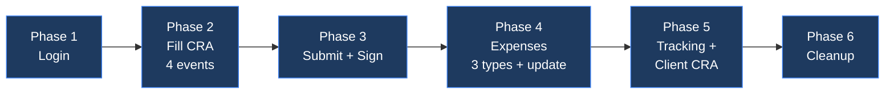
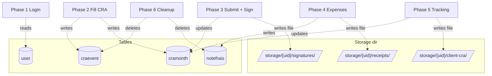
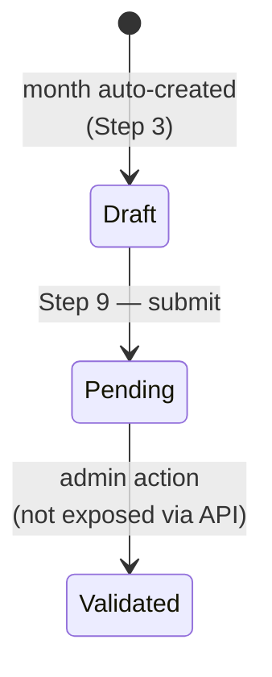

# Real-World Walkthrough — The Consultant Monthly Flow

> Hands-on runbook for the 28-step consultant workflow. Every step shows
> the request, the response, and how to verify the change actually landed
> in the database or filesystem.
>
> **Tool-agnostic.** The examples use `curl`, but you can fire the same
> requests from Apidog, Postman, httpx, or any HTTP client.

## Table of contents

- [Setup](#setup)
- [Overall flow](#overall-flow)
- [Phase 1 — Login](#phase-1--login)
- [Phase 2 — Fill the CRA](#phase-2--fill-the-cra)
- [Phase 3 — Submit & sign the month](#phase-3--submit--sign-the-month)
- [Phase 4 — Expenses](#phase-4--expenses)
- [Phase 5 — Tracking & client CRA](#phase-5--tracking--client-cra)
- [Phase 6 — Cleanup](#phase-6--cleanup)
- [DB cheat sheet](#db-cheat-sheet)
- [Storage cheat sheet](#storage-cheat-sheet)

---

## Setup

### 1. Make sure the server is running

```powershell
& "apidog\scripts\start_server.ps1"     # port 8005
```

Sanity check:

```bash
curl http://localhost:8005/healthz
# {"status":"ok"}
```

### 2. Pick a way to verify the DB

The mock uses **SQLite** at `mock-api/app.db`. Two equally valid ways to
inspect it after each step:

#### Option A — DB Browser for SQLite (GUI, recommended for visual checks)

1. Download from <https://sqlitebrowser.org/>
2. **Open Database** → pick `mock-api/app.db`
3. Click the **Browse Data** tab → pick a table from the dropdown
4. After each API call, click **🔄 Refresh** (or press F5) to see the new state

Tables you'll inspect throughout this walkthrough:

| Table | Holds |
|---|---|
| `user` | The demo user (1 row, auto-seeded) |
| `craevent` | Individual day entries on the calendar |
| `cramonth` | Aggregate per-month state (status, signature, client CRA) |
| `notefrais` | Expense entries |

#### Option B — sqlite3 CLI

```bash
sqlite3 mock-api/app.db "SELECT * FROM craevent;"
```

On Windows: install via `winget install --id=SQLite.SQLite` or use a portable
binary from <https://www.sqlite.org/download.html>.

### 3. Get a bearer token

Every step from Phase 2 onward needs a JWT in the `Authorization` header.
Phase 1 (Step 1) explains how to get one and store it as `$TOKEN`.

---

## Overall flow



Each phase mutates a specific table. The diagram below maps phase → table:



---

## Phase 1 — Login

### Step 1 — Login & store the JWT

**What:** authenticate the demo user and get a JWT.

**Request**

```bash
curl -X POST http://localhost:8005/api/auth/login \
  -H "Content-Type: application/x-www-form-urlencoded" \
  -d "username=demo@cra.local&password=demo1234"
```

PowerShell equivalent:

```powershell
$TOKEN = (curl -X POST http://localhost:8005/api/auth/login `
  -d "username=demo@cra.local&password=demo1234" | ConvertFrom-Json).access_token
```

**Response (200)**

```json
{
  "access_token": "eyJhbGciOiJIUzI1NiIsInR5cCI6IkpXVCJ9...",
  "token_type": "bearer"
}
```

**Store the token** as a shell variable so the rest of the steps can reuse it:

```bash
# bash
export TOKEN="eyJhbGciOi..."
```

**Verify the user exists** — DB Browser: open `user` table.

| id | email | full_name | role |
|---|---|---|---|
| 1 | demo@cra.local | Demo User | member |

SQL alternative:

```sql
SELECT id, email, full_name, role FROM user;
```

---

## Phase 2 — Fill the CRA

The consultant logs 4 events of varied shapes: a single day, a multi-day
range, an absence, and a half-day.

### Step 2 — Discover available activities (reference data)

**What:** fetch the dropdown values the front-end uses. Useful when
building any form that needs the allowed category/activity combos.

**Request**

```bash
curl http://localhost:8005/api/enums
```

**Response (200)** — truncated

```json
{
  "cra_categories": ["Absence", "Travail"],
  "cra_activities": {
    "Travail":  ["Prestation", "HNO", "Astreinte"],
    "Absence":  ["CP", "RTT", "Maladie", "Sans solde", "Autre"]
  },
  "expense_types": ["Restaurant", "Indemnités kilométriques", ...],
  "statuses": ["Draft", "Pending", "Verified", "Validated", "Rejected"]
}
```

**Verify:** this endpoint reads from `app/enums.py`, not the DB — there's
nothing in SQLite to check.

### Step 3 — Create a single work day (Travail / Prestation)

**What:** record one full day of client work today.

**Request**

```bash
curl -X POST http://localhost:8005/api/cra/events \
  -H "Authorization: Bearer $TOKEN" \
  -H "Content-Type: application/json" \
  -d '{
    "categorie": "Travail",
    "activity": "Prestation",
    "start_date": "2026-05-15",
    "end_date":   "2026-05-15",
    "all_day": true,
    "nb": 1.0,
    "description": "Client onsite"
  }'
```

**Response (201)**

```json
{
  "id": 4,
  "user_id": 1,
  "month": "2026-05",
  "categorie": "Travail",
  "activity": "Prestation",
  "start_date": "2026-05-15",
  "end_date": "2026-05-15",
  "all_day": true,
  "nb": 1.0,
  "description": "Client onsite"
}
```

**Verify** — DB Browser: open `craevent`, find `id=4`. Also note that
a new row appeared in `cramonth` for `2026-05` with `status=Draft` if it
didn't already exist (server creates it on the first event of a month).

SQL:

```sql
SELECT id, month, categorie, activity, nb, description
FROM craevent WHERE id = 4;

SELECT id, month, status FROM cramonth WHERE month = '2026-05';
-- expect: a Draft row (or existing one if month already started)
```

### Step 4 — Create a multi-day range (sprint week, days 1-3)

**What:** one event covering three consecutive days.

**Request**

```bash
curl -X POST http://localhost:8005/api/cra/events \
  -H "Authorization: Bearer $TOKEN" \
  -H "Content-Type: application/json" \
  -d '{
    "categorie": "Travail",
    "activity": "Prestation",
    "start_date": "2026-05-01",
    "end_date":   "2026-05-03",
    "all_day": true,
    "nb": 1.0,
    "description": "Sprint delivery"
  }'
```

**Response (201)** — same shape as Step 3, with the range dates.

**Verify** — DB Browser: `craevent` has 2 rows now for `month=2026-05`.
Both have `nb=1.0` but Step 4's row spans 3 calendar days.

### Step 5 — Create an absence (paid leave)

**What:** the consultant takes a CP day on the 5th.

**Request**

```bash
curl -X POST http://localhost:8005/api/cra/events \
  -H "Authorization: Bearer $TOKEN" \
  -H "Content-Type: application/json" \
  -d '{
    "categorie": "Absence",
    "activity": "CP",
    "start_date": "2026-05-05",
    "end_date":   "2026-05-05",
    "all_day": true,
    "nb": 1.0,
    "description": "Paid leave"
  }'
```

**Response (201):** `categorie=Absence`, `activity=CP`.

> **Common gotcha:** mismatched pairs (e.g. `categorie=Absence` +
> `activity=Prestation`) return `400`. The server enforces the table in
> [API.md §CRA categories vs activities](API.md).

### Step 6 — Create a half-day (nb = 0.5)

**What:** the consultant worked only the morning (afternoon was internal).

**Request**

```bash
curl -X POST http://localhost:8005/api/cra/events \
  -H "Authorization: Bearer $TOKEN" \
  -H "Content-Type: application/json" \
  -d '{
    "categorie": "Travail",
    "activity": "Prestation",
    "start_date": "2026-05-15",
    "end_date":   "2026-05-15",
    "all_day": false,
    "nb": 0.5,
    "description": "Morning only"
  }'
```

**Response (201):** `nb=0.5`, `all_day=false`.

> **Note:** `nb` must be in `(0, 1]`. Sending `nb=1.5` or `nb=0` returns `422`.

### Step 7 — List all events for the month

**What:** confirm all 4 events are visible.

**Request**

```bash
curl "http://localhost:8005/api/cra/events?month=2026-05" \
  -H "Authorization: Bearer $TOKEN"
```

**Response (200)** — array of 4 events created in steps 3-6.

**Verify in DB Browser:** `craevent` filtered by `month = '2026-05'` —
should show exactly 4 user-created rows (plus any seeded rows from when
the server was first started).

### Step 8 — Correct a mistake (update event description)

**What:** change the description of the half-day event.

**Request**

```bash
curl -X PUT http://localhost:8005/api/cra/events/6 \
  -H "Authorization: Bearer $TOKEN" \
  -H "Content-Type: application/json" \
  -d '{"description": "Morning Prestation — updated"}'
```

(Replace `6` with the `id` returned by Step 6.)

**Response (200):** the updated event with the new description.

**Verify** — DB Browser → `craevent` → row id=6 → `description` column
should now read `Morning Prestation — updated`. Also `updated_at` should
be more recent than `created_at`.

---

## Phase 3 — Submit & sign the month

### Step 9 — Submit the month for validation



**What:** moves the `cramonth` row from `Draft` to `Pending` and stamps
`submitted_at`.

**Request**

```bash
curl -X POST http://localhost:8005/api/cra/month/2026-05/submit \
  -H "Authorization: Bearer $TOKEN" \
  -H "Content-Type: application/json" \
  -d '{
    "description_tasks": "Prestation client + 1 CP",
    "reserve_use_eur": 0,
    "reserve_use_days": 0,
    "reserve_save_eur": 0,
    "reserve_save_days": 0
  }'
```

**Response (200)**

```json
{
  "id": 5,
  "user_id": 1,
  "month": "2026-05",
  "status": "Pending",
  "description_tasks": "Prestation client + 1 CP",
  "signature_path": null,
  "client_cra_path": null,
  "submitted_at": "2026-05-15T17:23:11.482932",
  "validated_at": null
}
```

**Verify** — DB Browser → `cramonth` → row where `month='2026-05'`:

| Column | Before Step 9 | After Step 9 |
|---|---|---|
| `status` | `Draft` | `Pending` |
| `submitted_at` | `NULL` | a timestamp |
| `description_tasks` | `''` | `Prestation client + 1 CP` |

SQL:

```sql
SELECT month, status, submitted_at, description_tasks
FROM cramonth WHERE month = '2026-05';
```

> **Re-submitting a Pending month** keeps it `Pending` and re-stamps
> `submitted_at`. Submitting a `Validated` month returns `409`.

### Step 10 — Upload the consultant's signature

**What:** attach a signature image (PNG/PDF) to the month.

**Request**

```bash
curl -X POST http://localhost:8005/api/cra/month/2026-05/signature \
  -H "Authorization: Bearer $TOKEN" \
  -F "file=@apidog/fixtures/sample_signature.png"
```

**Response (200):** `signature_path` is now a relative path to the saved file:

```json
{
  "id": 5,
  "month": "2026-05",
  "status": "Pending",
  "signature_path": "storage/1/signatures/a3f9c2...png",
  ...
}
```

**Verify in DB Browser:** `cramonth.signature_path` is no longer `NULL`.

**Verify on filesystem:**

```bash
ls mock-api/storage/1/signatures/
# expect: a UUID-named file with the same extension you uploaded
```

> All upload endpoints validate **extension** (`.pdf / .png / .jpg / .jpeg`)
> and size (≤ 5 MB). The original filename is **not** preserved — a UUID
> is used to avoid collisions.

---

## Phase 4 — Expenses

### Step 11 — Declare a Restaurant expense (with receipt)

**What:** create an expense in `Pending` state with a PDF receipt attached.

**Request** (multipart):

```bash
curl -X POST http://localhost:8005/api/expenses \
  -H "Authorization: Bearer $TOKEN" \
  -F "type=Restaurant" \
  -F "month=2026-05" \
  -F "description=Team lunch" \
  -F "total_amount=38.50" \
  -F "billable_to_client=true" \
  -F "comment=Project kickoff" \
  -F "receipt=@apidog/fixtures/sample_receipt.pdf"
```

**Response (201)**

```json
{
  "id": 3,
  "user_id": 1,
  "month": "2026-05",
  "type": "Restaurant",
  "description": "Team lunch",
  "total_amount": 38.5,
  "billable_to_client": true,
  "comment": "Project kickoff",
  "receipt_path": "storage/1/receipts/b9d0a1...pdf",
  "status": "Pending"
}
```

**Verify** — DB Browser → `notefrais` → new row, `status=Pending`,
`receipt_path` not null.

**Filesystem:**

```bash
ls mock-api/storage/1/receipts/
```

### Step 12 — Declare mileage (no receipt needed)

**What:** `Indemnités kilométriques` is the **only** expense type that
doesn't require a receipt.

**Request**

```bash
curl -X POST http://localhost:8005/api/expenses \
  -H "Authorization: Bearer $TOKEN" \
  -F "type=Indemnités kilométriques" \
  -F "month=2026-05" \
  -F "description=Paris->Lyon 450km" \
  -F "total_amount=202.50" \
  -F "billable_to_client=false"
```

**Response (201):** `receipt_path` is `null` for this expense.

**Verify:** DB Browser → `notefrais` row for this id → `receipt_path` is
`NULL`.

### Step 13 — Declare a train ticket (with receipt)

**What:** create a second expense of a different type.

**Request**

```bash
curl -X POST http://localhost:8005/api/expenses \
  -H "Authorization: Bearer $TOKEN" \
  -F "type=Titre de transport" \
  -F "month=2026-05" \
  -F "description=Train Paris-Lyon" \
  -F "total_amount=89.00" \
  -F "billable_to_client=true" \
  -F "receipt=@apidog/fixtures/sample_receipt.pdf"
```

**Response (201):** another row in `notefrais`, status `Pending`.

### Step 14 — Correct the restaurant amount

**What:** the consultant realized the receipt showed `42.00`, not `38.50`.
Update the expense.

**Request**

```bash
curl -X PUT http://localhost:8005/api/expenses/3 \
  -H "Authorization: Bearer $TOKEN" \
  -H "Content-Type: application/json" \
  -d '{
    "total_amount": 42.00,
    "comment": "Updated after checking the receipt"
  }'
```

**Response (200):** `total_amount` is now `42.0`.

**Verify** — DB Browser → `notefrais` → row `id=3` → `total_amount` is
`42.0`, `updated_at` newer than `created_at`.

> **Cannot update a Validated expense** — the PUT returns `409`.

### Step 15 — Filter all expenses for the year

**What:** confirm all 3 created expenses are present.

**Request**

```bash
curl -X POST http://localhost:8005/api/expenses/filter \
  -H "Authorization: Bearer $TOKEN" \
  -H "Content-Type: application/json" \
  -d '{"year": 2026, "page": 1, "limit": 50}'
```

**Response (200)** — pagination envelope:

```json
{
  "items": [
    { "id": 5, "type": "Titre de transport", ... },
    { "id": 4, "type": "Indemnités kilométriques", ... },
    { "id": 3, "type": "Restaurant", "total_amount": 42.0, ... }
  ],
  "total": 3,
  "page": 1,
  "pages": 1,
  "limit": 50
}
```

(Items are ordered by `created_at DESC` — newest first.)

### Step 16 — Filter by type (Restaurant only)

**Request**

```bash
curl -X POST http://localhost:8005/api/expenses/filter \
  -H "Authorization: Bearer $TOKEN" \
  -H "Content-Type: application/json" \
  -d '{"year": 2026, "type": "Restaurant", "page": 1, "limit": 10}'
```

**Response (200):** only the Restaurant entry returns.

### Step 17 — Delete the transport expense

**What:** the consultant regrets including this one — delete it.

**Request**

```bash
curl -X DELETE http://localhost:8005/api/expenses/5 \
  -H "Authorization: Bearer $TOKEN"
```

**Response (204):** empty body.

**Verify** — DB Browser → `notefrais` → row `id=5` is gone.

> **Cannot delete a Validated expense** — returns `409`.
>
> **Known caveat:** the underlying receipt file is NOT deleted from
> `storage/`. This is a documented mock simplification (see API.md).

### Step 18 — Confirm transport is gone

**Request:** same as Step 15.

**Response:** `total` is now `2`, transport ID no longer in `items`.

---

## Phase 5 — Tracking & client CRA

### Step 19 — Check tracking page (verify month is Pending)

**What:** the consultant opens the "My CRA Tracking" page and sees the
current month in `Pending` status with the signature attached.

**Request**

```bash
curl "http://localhost:8005/api/cra-tracking/months?page=1&limit=10" \
  -H "Authorization: Bearer $TOKEN"
```

**Response (200)** — paginated, sorted by `month DESC`:

```json
{
  "items": [
    {
      "id": 5,
      "month": "2026-05",
      "status": "Pending",
      "signature_path": "storage/1/signatures/a3f9c2...png",
      "client_cra_path": null,
      "submitted_at": "2026-05-15T17:23:11",
      "validated_at": null,
      ...
    },
    {
      "id": 4,
      "month": "2026-04",
      "status": "Validated",
      ...
    }
  ],
  "total": 5,
  "page": 1,
  "pages": 1,
  "limit": 10
}
```

> The seed adds 4 past `Validated` months — that's why `total ≥ 5` here.

### Step 20 — Upload the signed client CRA PDF

**What:** the client signed and emailed back the CRA — archive it.

**Request**

```bash
curl -X POST http://localhost:8005/api/cra-tracking/months/2026-05/import-client-cra \
  -H "Authorization: Bearer $TOKEN" \
  -F "file=@apidog/fixtures/sample_receipt.pdf"
```

**Response (200)**

```json
{
  "id": 5,
  "month": "2026-05",
  "status": "Pending",
  "signature_path": "storage/1/signatures/a3f9c2...png",
  "client_cra_path": "storage/1/client-cra/c7e1f8...pdf",
  ...
}
```

> **Important:** the target `cramonth` row must already exist. Trying to
> import to `2099-01` returns `404`.

**Verify on filesystem:**

```bash
ls mock-api/storage/1/client-cra/
```

### Step 21 — Verify client_cra_path stored

**Request:** repeat Step 19.

**Verify:** the row for `2026-05` now has both `signature_path` AND
`client_cra_path` populated.

---

## Phase 6 — Cleanup

### Steps 22-27 — Delete everything we created

For each ID, send a DELETE:

```bash
curl -X DELETE http://localhost:8005/api/expenses/3 -H "Authorization: Bearer $TOKEN"
curl -X DELETE http://localhost:8005/api/expenses/4 -H "Authorization: Bearer $TOKEN"
curl -X DELETE http://localhost:8005/api/cra/events/4 -H "Authorization: Bearer $TOKEN"
curl -X DELETE http://localhost:8005/api/cra/events/5 -H "Authorization: Bearer $TOKEN"
curl -X DELETE http://localhost:8005/api/cra/events/6 -H "Authorization: Bearer $TOKEN"
curl -X DELETE http://localhost:8005/api/cra/events/7 -H "Authorization: Bearer $TOKEN"
```

Each returns `204`.

### Step 28 — Final verification

```bash
curl "http://localhost:8005/api/cra/events?month=2026-05" \
  -H "Authorization: Bearer $TOKEN"
```

**Response:** empty array `[]` (or only the events that were there before
you started).

**Reset everything** (nuclear option):

```bash
# stop the server, then:
del mock-api\app.db
# restart — fresh DB, demo user re-seeded
```

---

## DB cheat sheet

Common queries you'll run during development:

```sql
-- All events for a user this month
SELECT id, categorie, activity, start_date, nb, description
FROM craevent
WHERE user_id = 1 AND month = '2026-05'
ORDER BY start_date;

-- All months for a user, with their status
SELECT month, status, submitted_at, validated_at
FROM cramonth
WHERE user_id = 1
ORDER BY month DESC;

-- Pending expenses for the year
SELECT id, month, type, total_amount, billable_to_client
FROM notefrais
WHERE user_id = 1 AND status = 'Pending' AND month LIKE '2026-%'
ORDER BY created_at DESC;

-- Months with a signature but no client CRA yet
SELECT month, signature_path, client_cra_path
FROM cramonth
WHERE signature_path IS NOT NULL AND client_cra_path IS NULL;

-- Reset a specific row to test 409 paths (use sparingly)
UPDATE cramonth SET status = 'Validated' WHERE month = '2026-05';
```

### Doing it in DB Browser instead

| Want to... | Steps |
|---|---|
| See all CRA events | Open `mock-api/app.db` → Browse Data → `craevent` |
| Filter by month | Click the column filter under `month` → type `2026-05` |
| Re-check after an API call | Press F5 |
| Run ad-hoc SQL | Execute SQL tab → paste a query → ▶ |
| See an updated row | Browse Data → `notefrais` → look at `updated_at` |

---

## Storage cheat sheet

Uploaded files land in this structure:

```
mock-api/storage/
└── <user_id>/
    ├── signatures/        ← Step 10 outputs
    │   └── <uuid>.png
    ├── receipts/          ← Step 11, 13 outputs
    │   └── <uuid>.pdf
    └── client-cra/        ← Step 20 outputs
        └── <uuid>.pdf
```

| Want to... | Command (PowerShell) |
|---|---|
| See all signatures | `ls mock-api\storage\1\signatures\` |
| See all receipts | `ls mock-api\storage\1\receipts\` |
| See all client CRAs | `ls mock-api\storage\1\client-cra\` |
| Wipe one user's uploads | `rm -r mock-api\storage\1` |
| Wipe all uploads | `rm -r mock-api\storage` |

> The `storage/` directory is auto-created on first upload — you don't need
> to pre-create it.

---

## Related docs

- [`docs/API.md`](API.md) — full endpoint reference (schemas, status codes)
- [`../README.md`](../README.md) — mock-api quickstart
- [`../../CLAUDE.md`](../../CLAUDE.md) — project map + testing strategies
- [`../../apidog/scenarios/real_world_flow.md`](../../apidog/scenarios/real_world_flow.md) — same flow expressed for Apidog/Postman
- [`../tests/scenarios/test_real_world.py`](../tests/scenarios/test_real_world.py) — same flow as a pytest test
